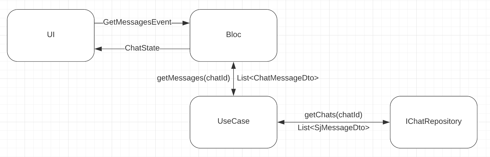
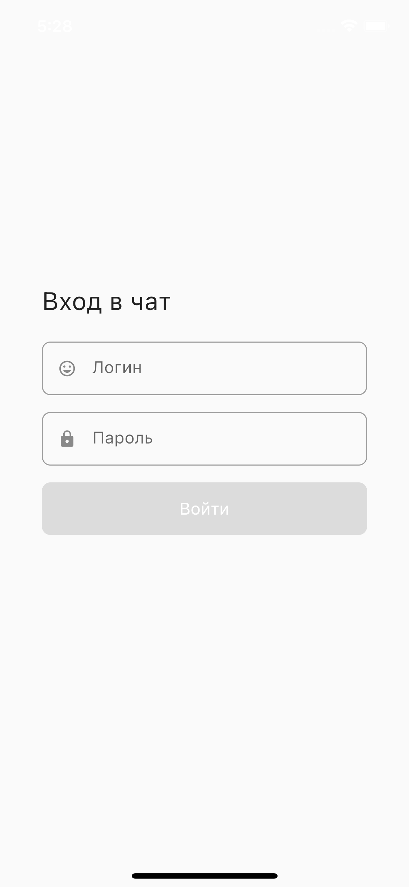
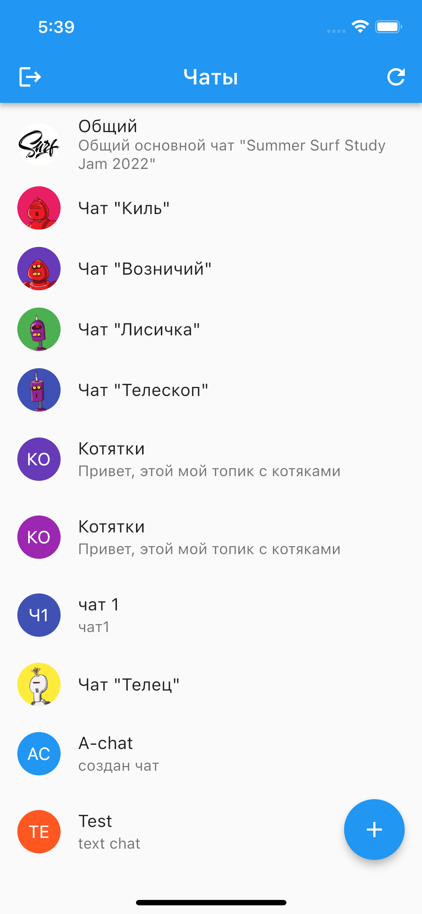
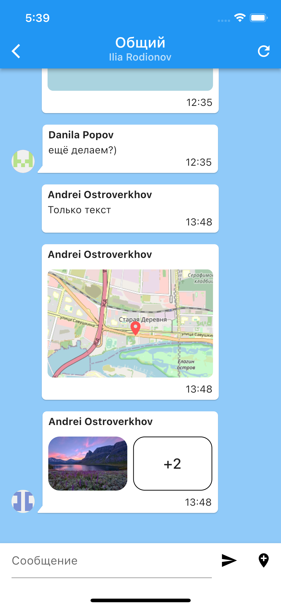
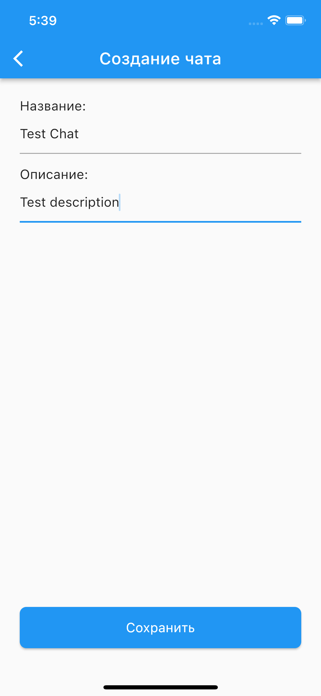

# Целевая платформа

* iOS (разработка велась на эмуляторе iPhone 13)
* Android (тестировал на своем телефоне, но верстка страшнее получилась))

Так же доступна релизная сборка для android: [ссылка](https://api.codemagic.io/artifacts/29c2a070-0992-4056-9b5f-857b8bc269dc/82a11929-163f-4b71-b65e-e6201b9e3350/app-release.apk])

# Результаты

За время соревнования я успел выполнить все представленные задания (кроме отправки сообщений с изображениями).
Далее я рассмотрю основные аспекты разработки:

## Используемые библиотеки

* State Management - Bloc, Flutter Bloc
* DI - GetIt, Injectable
* Storage - Flutter secure storage
* Баблы - Bubble
* Форматирование даты - Intl
* Отображение карты - Flutter map
* Открытие сторонних карт - Map launcher
* Работа с геопозицией - Location, Latlong2, Geolocator

## Архитектура приложения

В целом использовалась следующая схема (на примере загрузки сообщений):



Блок связывает представление и логику приложения, он обрабатывает событие и отдаёт на выход определенные состояния. 
Например, когда пользователь заходит в определенный чат, возникает событие:
```dart
class GetMessagesEvent implements ChatEvent {
  const GetMessagesEvent();
}
```
И передаётся соответствующему блоку, и там оно обрабатывается:
1. Сначала показывается состояние загрузки: `emit(LoadingChatState(state));`
2. Потом загружается сообщения с помощью юзкейса: `final messages = await _chatUseCase.getMessages(state.chatId);`
3. После ответа переводит его в определенный стейт: 
```dart
emit(messages.fold(
  (f) => FailedChatState(state, f.toString()),
  (m) => state.copyWithMessages(m),
));
```

В юзкейсе содержится логика приложения. Например, в юзкейсе загрузки сообщений, загружаются сами сообщения, фильтруются, 
группируются (для отображения последнего сообщения с аватаром), а так же соединяются с пользователями:
```dart
Future<Iterable<ChatMessageDto>> _fetchMessages(int chatId) async {
  final rawMessages = await _chatRepository.getMessages(chatId);
  if (rawMessages.isEmpty) return [];

  final userIds = rawMessages.map((m) => m.userId).toSet().toList();
  final users = await _chatRepository.getUsers(userIds);

  final messages = <ChatMessageDto>[];
  for (var i = 0; i < rawMessages.length; i++) {
    final m = rawMessages[i];
    final user = users.firstWhere((userDto) => userDto.id == m.userId);
    late final bool isLast;

    if (i != (rawMessages.length - 1)) {
      final next = rawMessages[i + 1];
      isLast = m.userId != next.userId;
    } else {
      isLast = true;
    }

    messages.add(ChatMessageDto.create(
      message: m,
      user: user,
      isLast: isLast,
    ));
  }

  return messages.where((m) => m.isValid).toList();
}
```

В целом большинство фич обрабатываются соответственным способом.

# Ссылки на демонстрацию работы/скриншоты

### Вход в приложение



### Список топиков



### Чат



### Создание топика



### Просмотр изображений (если в сообщение приложено более двух изображений)

